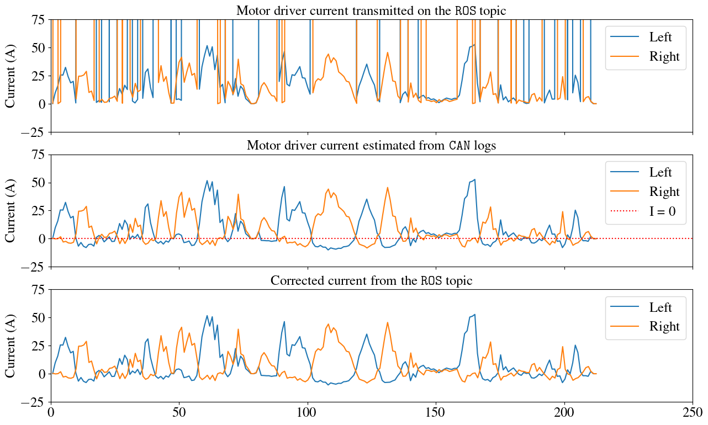

# Warthog SEVCON Fix

This package fixes current values that are given by the ROS topics on Clearpath Warthog (also known as Argo J5).

The `sevcon_traction_node` in the Warthog publishes two topics that contains motor current measurements :

- `/left_drive/status/battery_current`
- `/right_drive/status/battery_current`

Both topics contain messages that contains unsigned floats. Hence, when the current is negative (going back to the battery or to other components of the Warthog), the messages are returning current values of ~4000 A.

The node in this package subscribes to these topics, corrects the data by casting the current values to a signed float, and publishes back the corrected data to the following topics :

- `/sevcon/battery_current/left`
- `/sevcon/battery_current/right`

The following figure shows how the node corrects motor driver measurements :

- Top : Motor current measurements published on ROS topics by Clearpath's `sevcon_traction_node`
- Middle : Actual measurements that are sent by the SEVCONs motor controller on the CAN bus
- Bottom : Corrected current measurements that are published by our node

